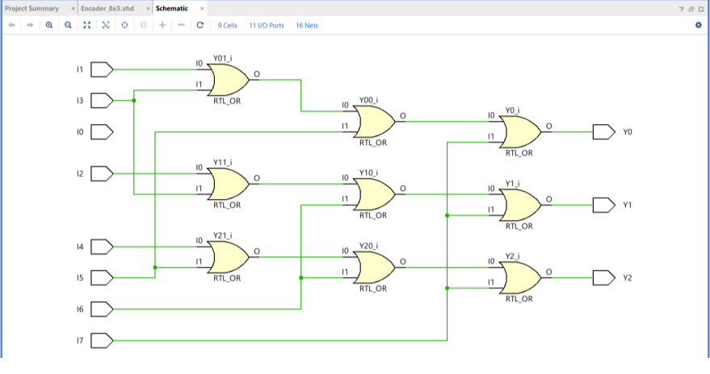
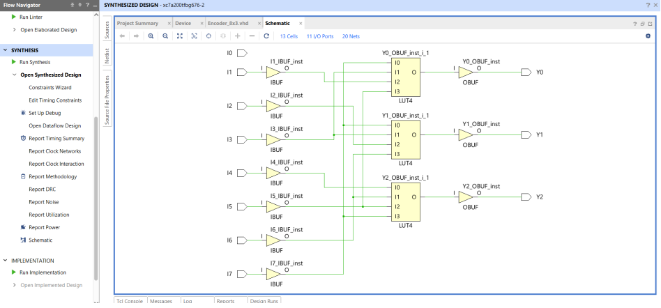
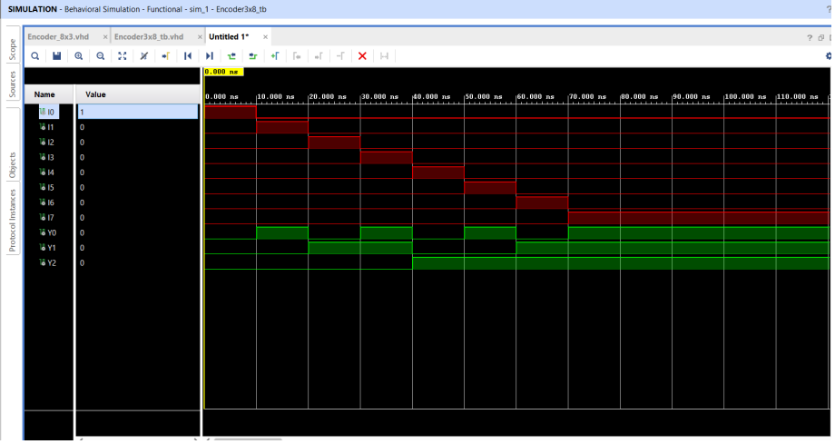
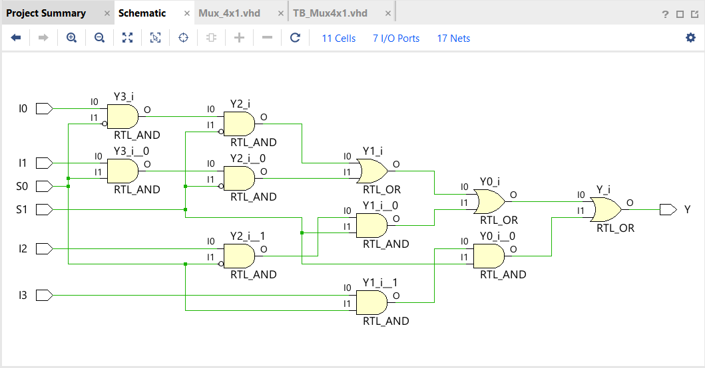
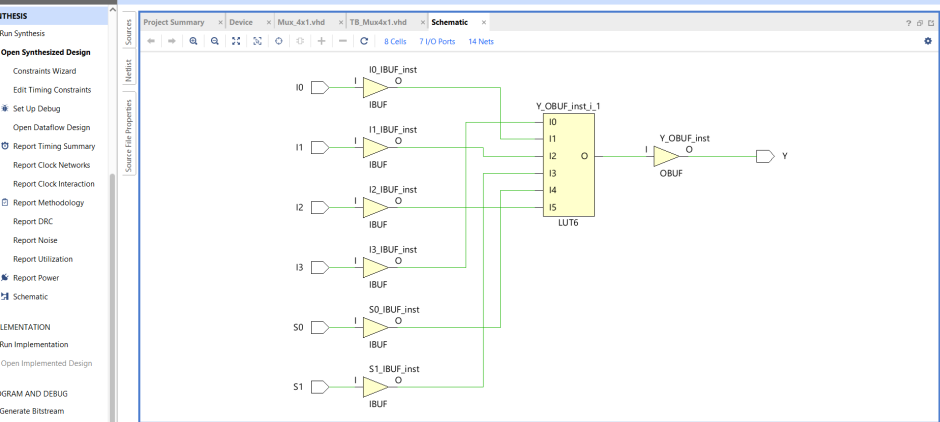
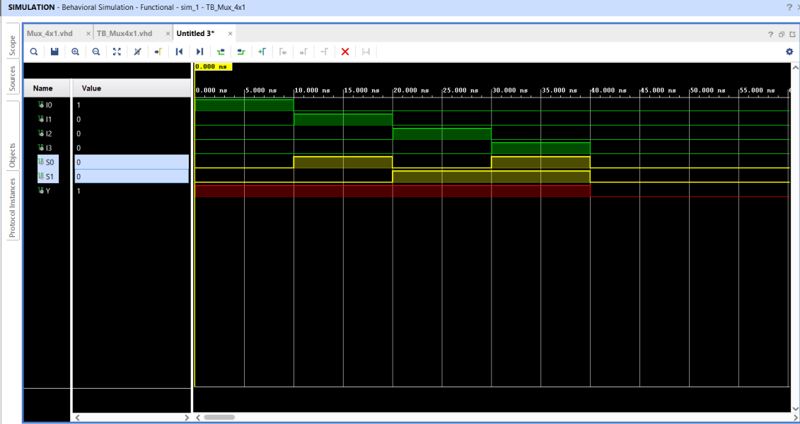
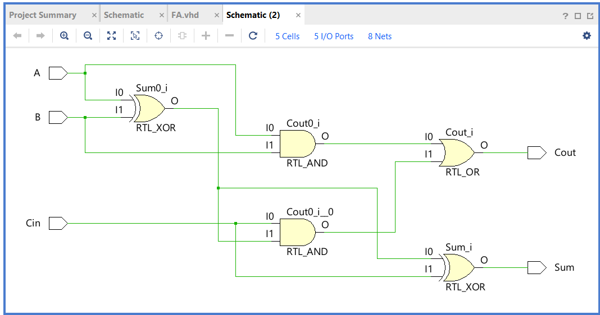
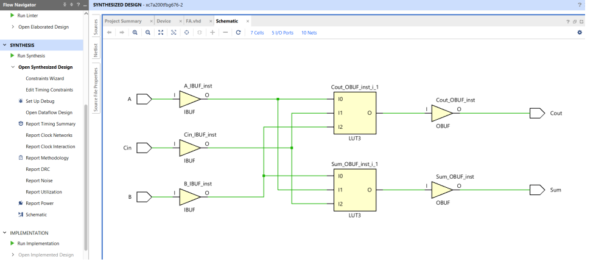
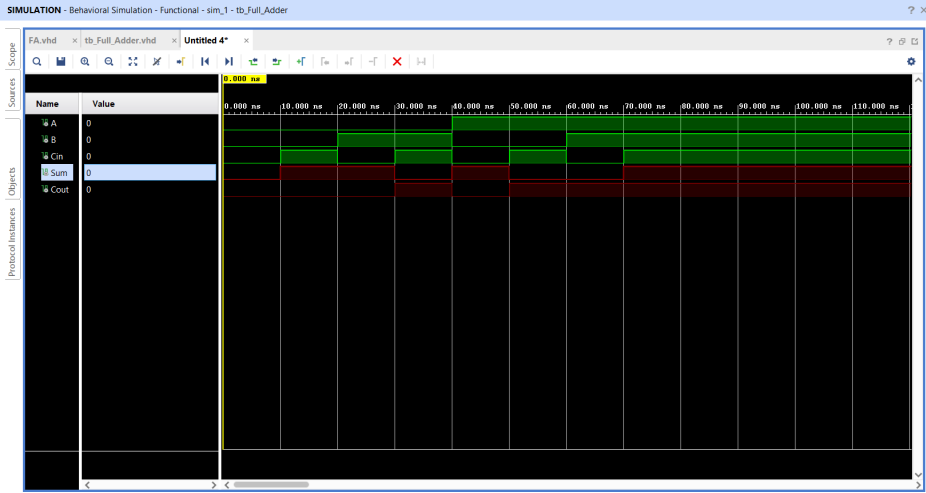

# Gate-Level Logic – VHDL

## Overview

This project contains three fundamental digital logic circuits implemented in VHDL using **gate-level logic**. The designs were developed and verified using **Xilinx Vivado**, including RTL design, synthesis, and simulation.

### Designs

* **8×3 Encoder**
* **4×1 Multiplexer**
* **Full Adder**

Each design includes its VHDL implementation, a dedicated testbench, synthesis results, and simulation results.

---

## Tools & Technologies

* **VHDL**
* **Xilinx Vivado**
* RTL Design
* Gate-Level Logic
* Digital Logic Design
* Simulation and Verification
* Synthesis

---

## 1. 8×3 Encoder

The 8×3 encoder converts one of eight input signals into a corresponding 3-bit binary output.

The circuit was implemented using gate-level logic in VHDL and verified through simulation.

### RTL Implementation

`VHDL/Encoder_8x3.vhd`

### Testbench

`Testbenches/TB_Encoder_8x3.vhd`

### Schematic / RTL Design

### Synthesis

### Simulation

---

## 2. 4×1 Multiplexer

The 4×1 multiplexer selects one of four input signals based on the select inputs and routes the selected signal to the output.

The multiplexer was implemented using gate-level logic in VHDL and verified through simulation.

### RTL Implementation

`VHDL/Mux_4x1.vhd`

### Testbench

`Testbenches/TB_Mux_4x1.vhd`

### Schematic / RTL Design

### Synthesis

### Simulation

---

## 3. Full Adder

The full adder performs binary addition of two input bits along with a carry-in input, producing a sum output and a carry-out output.

The circuit was implemented using gate-level logic in VHDL and verified through simulation.

### RTL Implementation

`VHDL/FA.vhd`

### Testbench

`Testbenches/tb_Full_Adder.vhd`

### Schematic / RTL Design

### Synthesis

### Simulation

---

## Design Process

Each circuit followed the same general hardware design workflow:

1. Design the digital logic using gate-level logic.
2. Implement the circuit in VHDL.
3. Create a dedicated VHDL testbench.
4. Simulate the design to verify its behavior.
5. Synthesize the design using Xilinx Vivado.
6. Review the resulting synthesized hardware structure.

## Summary

This assignment provided practical experience implementing fundamental combinational logic circuits in VHDL using gate-level descriptions. The designs demonstrate the use of basic logic gates to construct larger digital components, along with the process of synthesizing and verifying the resulting hardware designs.
