# Conditional and Selected Statements – VHDL

## Overview

This project focuses on two forms of **Concurrent Signal Assignment (CSA)** in VHDL:

* **Conditional Signal Assignment** using `when ... else`
* **Selected Signal Assignment** using `with ... select`

Three combinational digital components were implemented using both methods. The designs were developed and verified using **Xilinx Vivado**, including RTL design, synthesis, and simulation.

### Designs

* **8×3 Encoder**
* **4×1 Multibit MUX**
* **1×8 DEMUX**

Each component was implemented twice, once using conditional signal assignment and once using selected signal assignment.

---

## Tools & Technologies

* **VHDL**
* **Xilinx Vivado**
* Concurrent Signal Assignment (CSA)
* `when ... else`
* `with ... select`
* RTL Design
* Digital Logic Design
* Simulation and Synthesis

---

## 1. 8×3 Encoder

The 8×3 encoder converts eight input signals into a corresponding 3-bit output.

The encoder was implemented using both conditional and selected signal assignment.

### Conditional Implementation

Uses `when ... else` statements.

**RTL:** `VHDL/Encoder_8x3_Conditional.vhd`

**Testbench:** `Testbenches/TB_Encoder_8x3_Conditional.vhd`

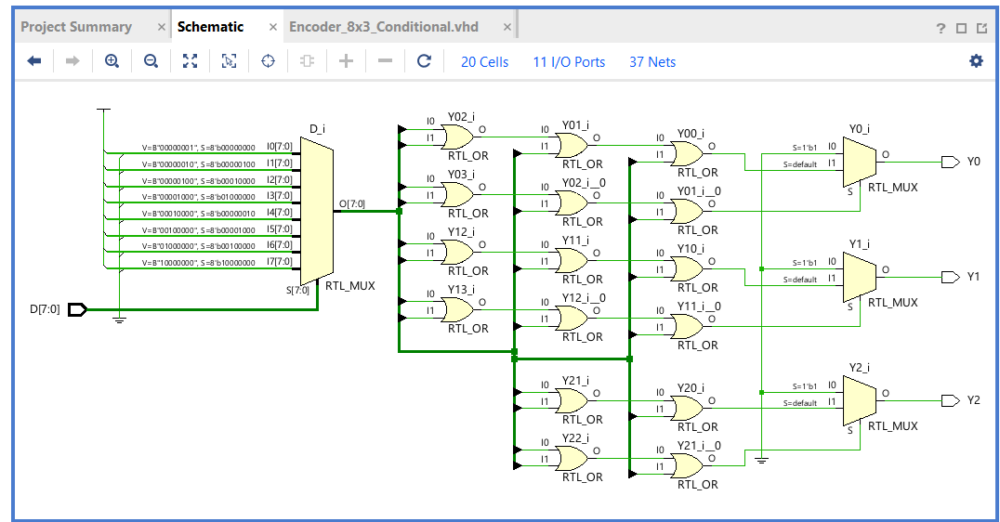

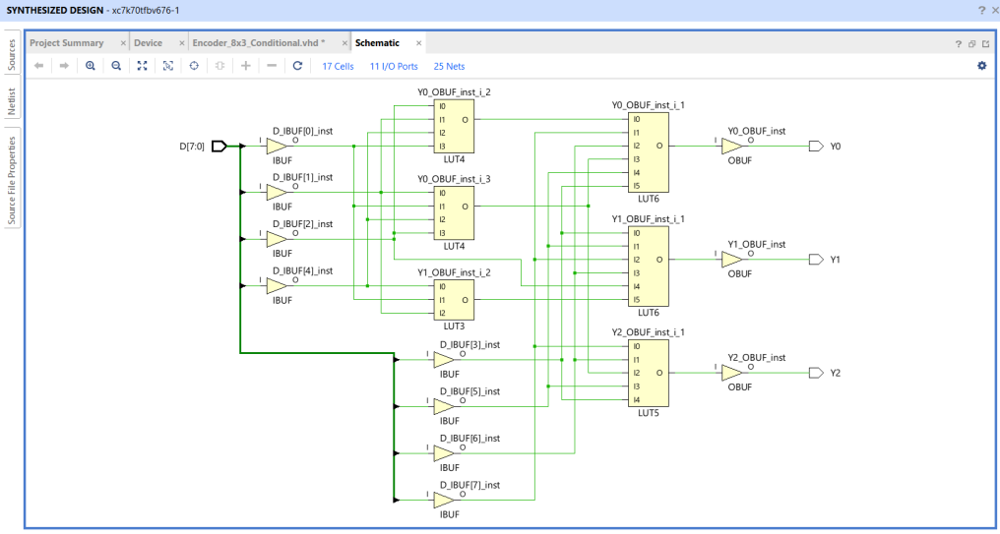

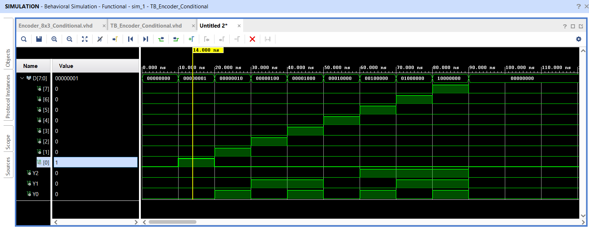

### Selected Implementation

Uses `with ... select` statements.

**RTL:** `VHDL/Encoder_8x3_Selected.vhd`

**Testbench:** `Testbenches/TB_Encoder_8x3_Selected.vhd`

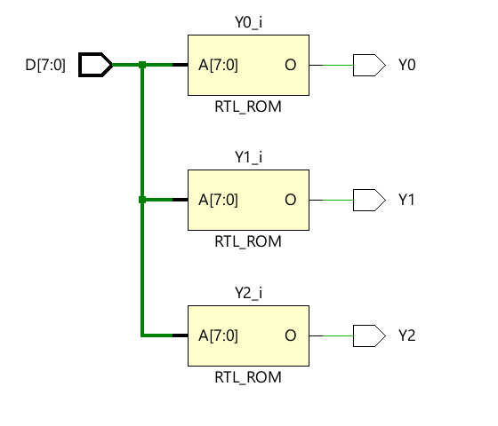

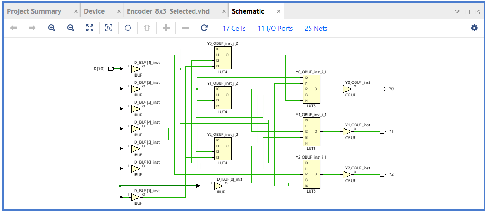

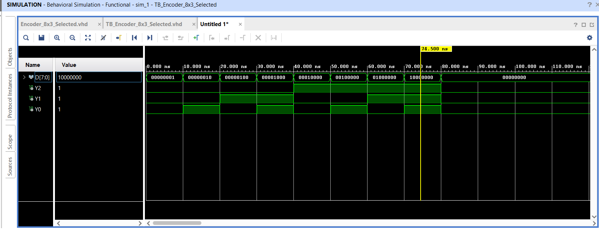

---

## 2. 4×1 Multibit MUX

The 4×1 multiplexer selects one of four **3-bit input vectors** based on the select signals and produces a 3-bit output vector.

The MUX was implemented using both conditional and selected signal assignment.

### Conditional Implementation

Uses `when ... else` statements.

**RTL:** `VHDL/Mux_4x1_Conditional.vhd`

**Testbench:** `Testbenches/TB_Mux_4x1_Conditional.vhd`

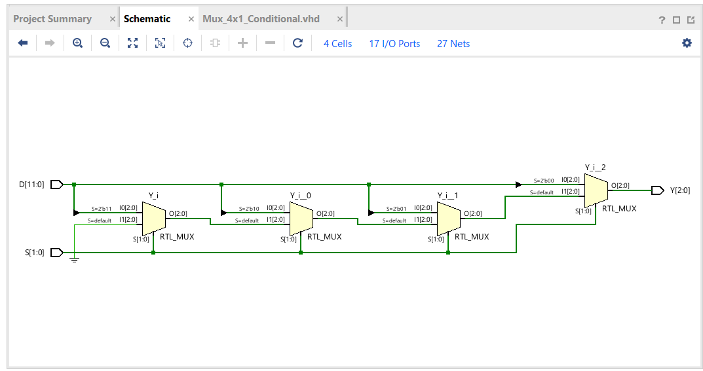

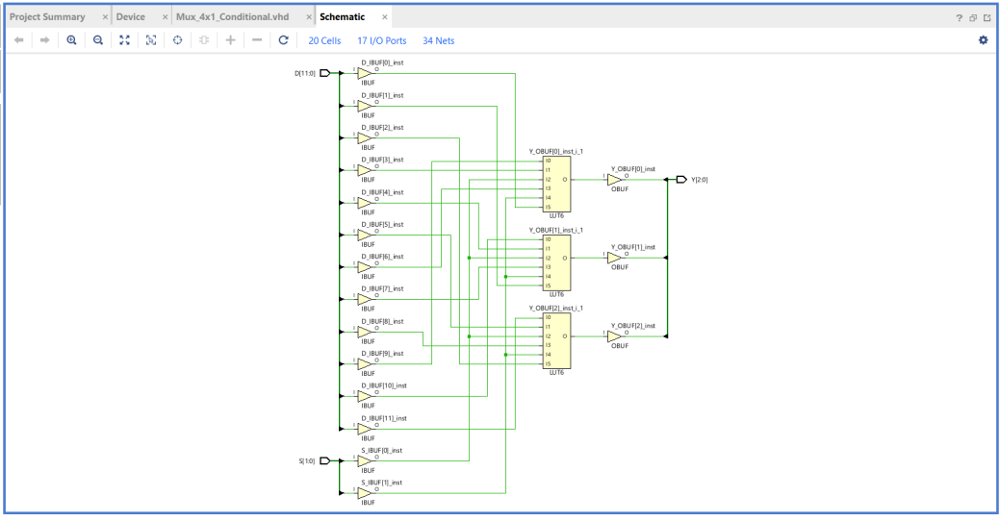

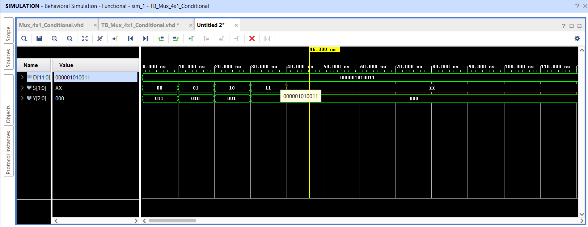

### Selected Implementation

Uses `with ... select` statements.

**RTL:** `VHDL/Mux_4x1_Selected.vhd`

**Testbench:** `Testbenches/TB_Mux_4x1_Selected.vhd`

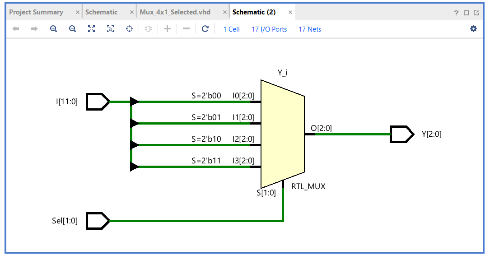

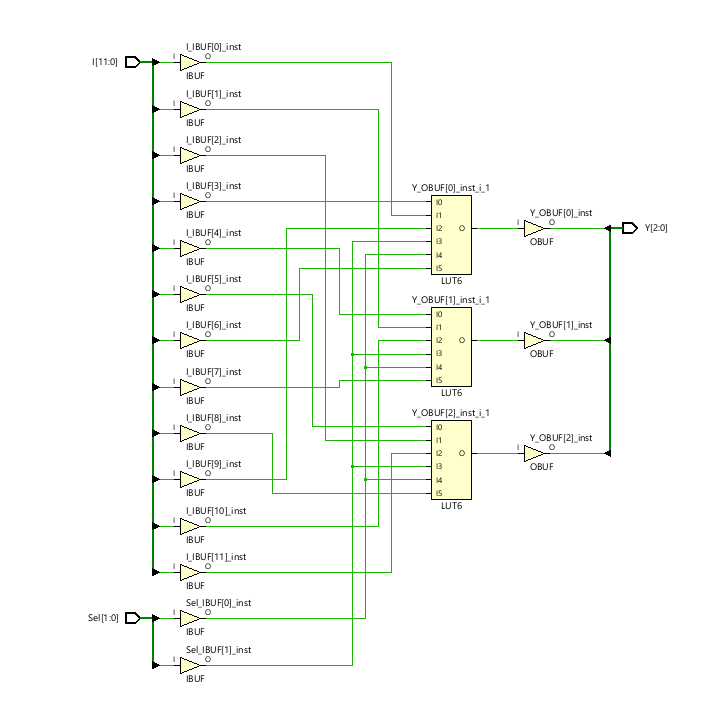

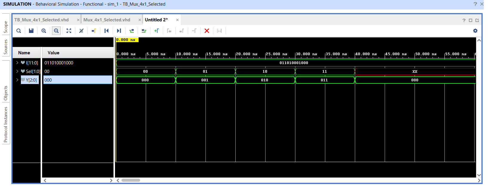

---

## 3. 1×8 DEMUX

The 1×8 demultiplexer routes a single input signal to one of eight output lines based on the select signals.

The DEMUX was implemented using both conditional and selected signal assignment.

### Conditional Implementation

Uses `when ... else` statements.

**RTL:** `VHDL/Demux_1x8_Conditional.vhd`

**Testbench:** `Testbenches/TB_Demux_1x8_Conditional.vhd`

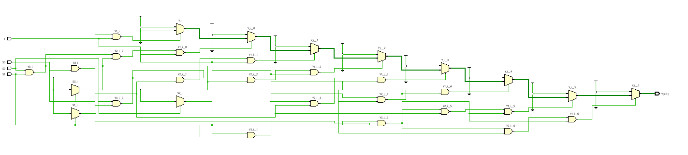

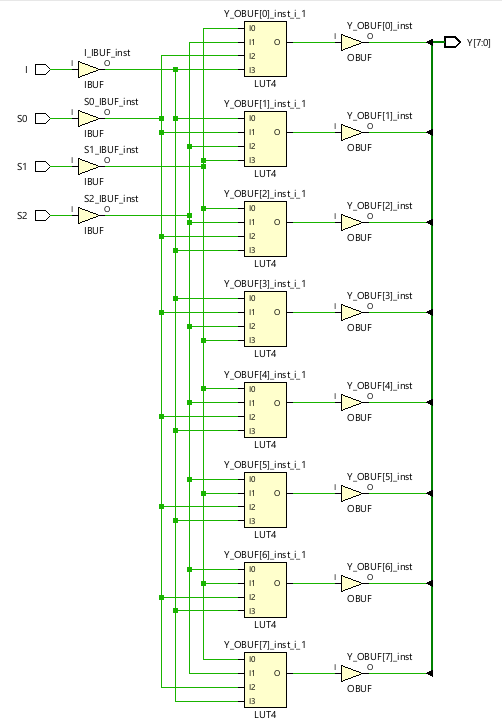

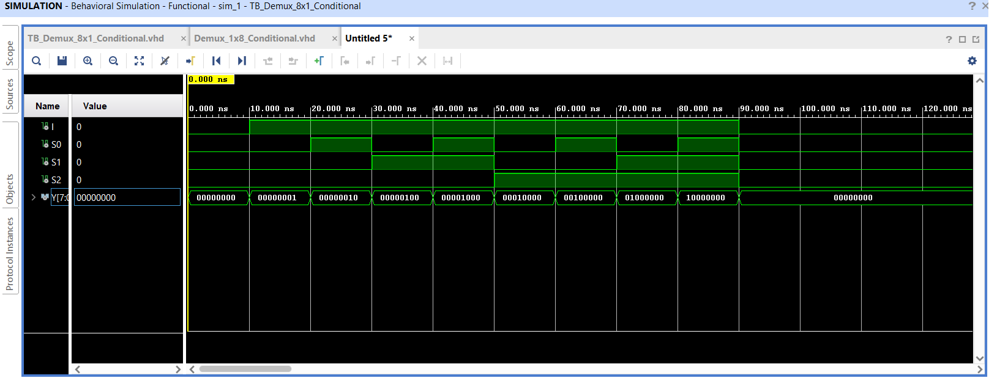

### Selected Implementation

Uses `with ... select` statements.

**RTL:** `VHDL/Demux_1x8_Selected.vhd`

**Testbench:** `Testbenches/TB_Demux_1x8_Selected.vhd`

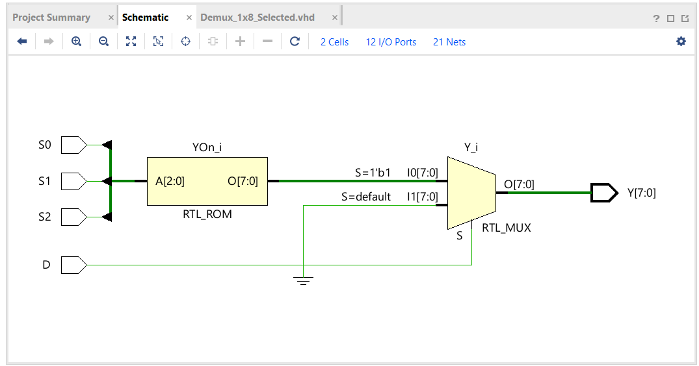

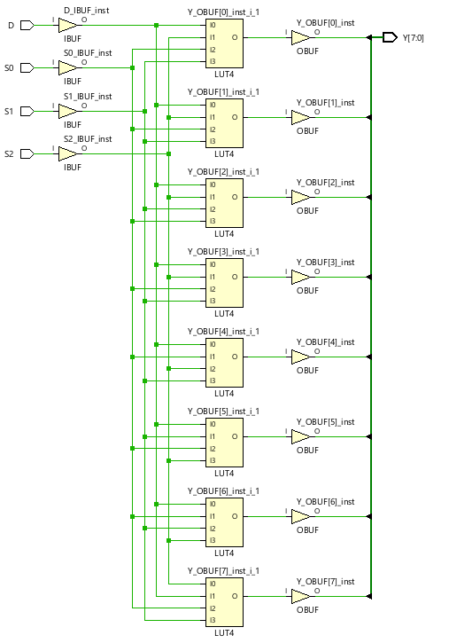_)
