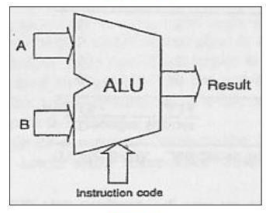
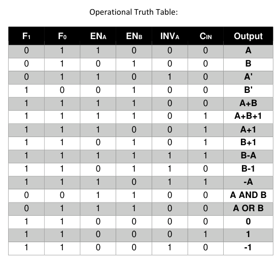
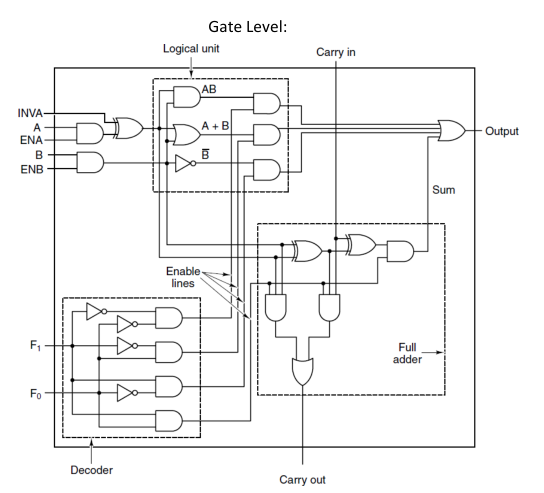
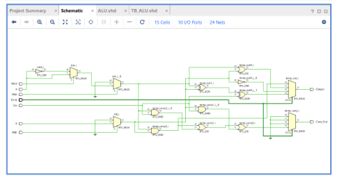
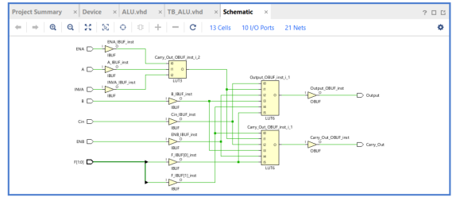
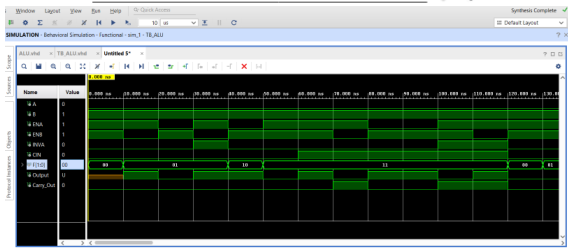

# 1-Bit ALU – Behavioral VHDL Design

## Overview

This project implements a 1-bit Arithmetic Logic Unit (ALU) using behavioral VHDL.

The ALU accepts two 1-bit data inputs, A and B, together with enable, inversion, function-selection, and carry signals. Depending on the control inputs, the ALU can perform several logical and arithmetic operations.

The design demonstrates how a small ALU can be described behaviorally using VHDL `Process` statements and verified using a dedicated testbench.

---

## ALU Block Diagram

The overall structure of the 1-bit ALU is shown below.



The ALU receives the following inputs:

| Signal | Description |
|--------|-------------|
| `A` | 1-bit data input |
| `B` | 1-bit data input |
| `ENA` | Enables or disables input A |
| `ENB` | Enables or disables input B |
| `INVA` | Controls inversion of A |
| `F1, F0` | Function-selection inputs |
| `Cin` | Carry input |

The ALU produces two outputs:

| Signal | Description |
|--------|-------------|
| `Output` | ALU result |
| `Carry_Out` | Carry generated by the arithmetic operation |

---

## Input Control

Before the ALU operation is selected, the input signals pass through an input-control stage.

### Input A

`ENA` determines whether A is enabled.

When A is enabled, `INVA` determines whether A is used directly or inverted.

```text
ENA = 0
→ A is disabled

ENA = 1, INVA = 0
→ A

ENA = 1, INVA = 1
→ NOT A
```

### Input B

`ENB` determines whether B is enabled.

```text
ENB = 0
→ B is disabled

ENB = 1
→ B
```

The enable and inversion controls allow the ALU to use the same hardware to implement multiple different functions.

---

## Function Selection

The function-selection inputs `F1` and `F0` determine which main operation is performed.

| F1 | F0 | Operation |
|----|----|-----------|
| 0 | 0 | AND |
| 0 | 1 | OR |
| 1 | 0 | NOT B |
| 1 | 1 | Full Adder |

The complete truth table for the ALU is shown below.

### ALU Truth Table



The truth table shows how the control signals determine the ALU output and, where applicable, the carry output.

---

## ALU Operations

### AND Operation

When:

```text
F1F0 = 00
```

the ALU performs an AND operation on the processed inputs.

```text
Output = A AND B
```

### OR Operation

When:

```text
F1F0 = 01
```

the ALU performs an OR operation.

```text
Output = A OR B
```

### NOT B Operation

When:

```text
F1F0 = 10
```

the ALU produces the inverse of B.

```text
Output = NOT B
```

### Full Adder Operation

When:

```text
F1F0 = 11
```

the ALU performs a 1-bit full-adder operation using A, B, and `Cin`.

The output is:

```text
Output = A XOR B XOR Cin
```

The carry output is:

```text
Carry_Out =
(A AND B) OR
(A AND Cin) OR
(B AND Cin)
```

The carry output allows the 1-bit ALU to participate in larger multi-bit arithmetic structures.

---

## Gate-Level Representation

Although the VHDL implementation uses behavioral `Process` statements, the ALU can also be represented using its underlying digital logic.



This representation shows how the input-control logic, function selection, logical operations, and arithmetic logic combine to produce the final ALU outputs.

The gate-level representation provides a connection between the behavioral VHDL description and the corresponding digital hardware.

---

## Behavioral VHDL Implementation

The ALU was implemented using multiple VHDL `Process` statements.

The first process handles the input-control stage:

- Enable or disable A using `ENA`
- Optionally invert A using `INVA`
- Enable or disable B using `ENB`

The second process handles the selected ALU operation.

A `case` statement uses `F1` and `F0` to select the required operation and generate the corresponding `Output` and `Carry_Out` values.

Using multiple processes separates the input preparation from the actual ALU operation and makes the behavioral design easier to understand.

---

## Why Multiple Processes?

The assignment requires the ALU to be implemented using at least two `Process` statements.

The design therefore separates the functionality into two main stages:

1. **Input preparation**
   - Enable A and B
   - Invert A when required

2. **ALU operation**
   - Select the required function
   - Generate the output
   - Generate the carry output

The same functionality could theoretically be combined into a single process, but separating the processes provides a clearer behavioral structure and satisfies the assignment requirements.

---

## Testbench

A dedicated VHDL testbench was created to verify the ALU.

The testbench applies different combinations of:

- A
- B
- `ENA`
- `ENB`
- `INVA`
- `F1`
- `F0`
- `Cin`

A `FOR LOOP` is used to systematically apply multiple input combinations, with `wait` statements between test cases.

The resulting outputs are compared against the expected behavior from the ALU truth table.

---

# Vivado Results

The following images show the results of implementing and testing the behavioral ALU design in Xilinx Vivado.

## Schematic

The Vivado schematic shows the hardware generated from the behavioral VHDL description.



## Synthesis

The synthesis result shows how the behavioral description is translated into digital hardware.



## Simulation

The simulation waveform verifies the ALU behavior for the different input and control combinations applied by the testbench.



---

## Project Structure

```text
Q2 - 1-Bit ALU/
├── README.md
├── VHDL/
│   └── [ALU VHDL source]
├── Testbenches/
│   └── [ALU testbench]
└── Images/
    ├── alu_black_box.png
    ├── alu_gate_level.png
    ├── alu_schematic.png
    ├── alu_simulation.png
    ├── alu_synthesis.png
    └── alu_truth_table.png
```

---

## Tools and Concepts

- VHDL
- Xilinx Vivado
- Behavioral RTL Design
- VHDL `Process` statements
- `case` statements
- 1-bit ALU design
- Boolean logic
- Enable and inversion logic
- Full Adder
- Carry generation
- Testbench development
- `FOR LOOP`
- `wait` statements
- Simulation
- RTL synthesis