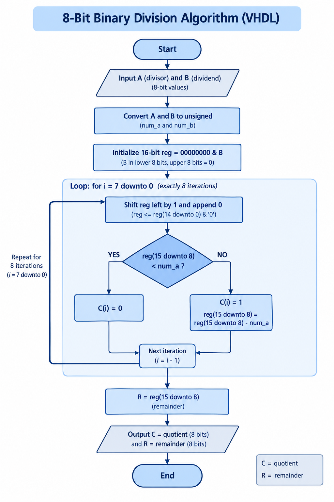
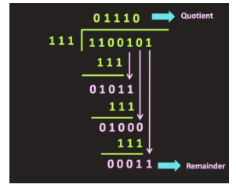
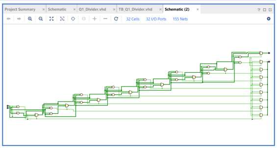
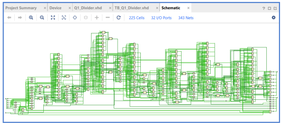
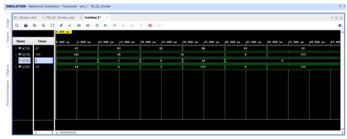

# 8-Bit Binary Divider – Process and For Loop

## Overview

This project implements an 8-bit unsigned binary divider using behavioral VHDL.

The design divides an 8-bit dividend by an 8-bit divisor and produces an 8-bit quotient and an 8-bit remainder. The divider uses a VHDL `Process` together with a `for` loop to perform the division iteratively using shifting, comparison, and subtraction.

The project also includes a testbench that uses a `for` loop and `wait` statements to verify different input combinations.

---

## System Structure

The divider has two 8-bit inputs and two 8-bit outputs:

| Signal | Direction | Description |
|--------|-----------|-------------|
| `A` | Input | 8-bit divisor |
| `B` | Input | 8-bit dividend |
| `C` | Output | 8-bit quotient |
| `R` | Output | 8-bit remainder |

The basic relationship is:

```text
B = (C × A) + R
```

where:

- `B` is the dividend
- `A` is the divisor
- `C` is the quotient
- `R` is the remainder

---

## Division Algorithm

The divider implements an iterative binary division algorithm based on shifting, comparing, and subtracting.

The internal register is initialized using the dividend:

```text
reg = 00000000 & B
```

The algorithm then performs 8 iterations. During each iteration:

1. The register is shifted left.
2. The upper 8 bits are compared with the divisor `A`.
3. If the upper portion is smaller than `A`, the corresponding quotient bit is set to `0`.
4. Otherwise, the divisor is subtracted and the quotient bit is set to `1`.
5. After all 8 iterations, the upper 8 bits contain the remainder.

This process is similar to binary long division and allows the quotient and remainder to be calculated using a sequence of simple operations.

---

## Division Algorithm Flowchart

The following flowchart illustrates the algorithm implemented by the VHDL process.



---

## Binary Long Division Example

As an example, consider dividing the decimal value 101 by 7:

```text
101 ÷ 7 = 14 remainder 3
```

Using 8-bit binary representations:

```text
B = 01100101
A = 00000111

C = 00001110
R = 00000011
```

The result can be verified arithmetically:

```text
101 = (14 × 7) + 3
```

Therefore:

```text
Quotient  = 14
Remainder = 3
```

The following diagram illustrates the binary long-division process.



---

## VHDL Implementation

The divider is implemented using a behavioral VHDL `Process`.

The input signals are converted to `unsigned` values using the IEEE `NUMERIC_STD` package. This allows the design to perform unsigned comparisons and subtraction.

The main division loop is:

```vhdl
for i in 7 downto 0 loop
```

The loop executes eight times, once for each quotient bit.

During each iteration, the internal register is shifted and its upper portion is compared against the divisor. Depending on the comparison, the corresponding quotient bit is generated and the divisor is subtracted when necessary.

At the end of the process:

- `C` contains the quotient.
- `R` contains the remainder.

---

## Testbench

A dedicated VHDL testbench was created to verify the divider.

The testbench uses a `FOR LOOP` together with `wait` statements to apply multiple input combinations.

The test cases include:

- Normal division with a non-zero remainder
- Division with an exact quotient
- Zero divided by a non-zero number
- Division by zero
- Additional combinations used to verify the divider behavior

The expected quotient and remainder can be compared against the simulation results to verify the implementation.

---

## Vivado Results

The divider was implemented and evaluated using Xilinx Vivado.

### Schematic

The Vivado schematic shows the hardware structure generated from the behavioral VHDL description.



### Synthesis

The synthesis result shows how the behavioral VHDL description is translated into digital hardware.



### Simulation

The simulation waveform demonstrates the divider's behavior for the input combinations applied by the testbench.



---

## Project Structure

```text
Q1 - 8-Bit Divider/
├── README.md
├── VHDL/
│   └── Q1_Divider.vhd
├── Testbenches/
│   └── TB_Q1_Divider.vhd
└── Images/
    ├── divider_flowchart.png
    ├── divider_long_division_example.png
    ├── divider_schematic.png
    ├── divider_simulation.png
    └── divider_synthesis.png
```

---

## Tools and Concepts

- VHDL
- Xilinx Vivado
- Behavioral RTL Design
- VHDL `Process`
- `FOR LOOP`
- `wait` statements
- `unsigned` arithmetic
- Binary division
- Shift operations
- Comparison and subtraction
- Testbench development
- Simulation
- RTL synthesis