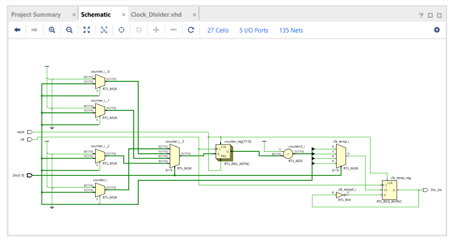
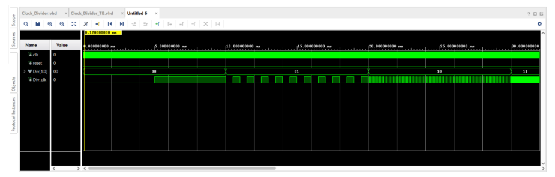

# Clock Divider – Synchronous Frequency Selection

## Overview

This project implements a configurable clock divider in VHDL.

The design receives an external 50 MHz clock and generates a lower-frequency output clock. The output frequency is selected using a 2-bit synchronous control signal, `Div`.

Four output frequencies are supported:

- 100 Hz
- 1 kHz
- 10 kHz
- 100 kHz

The divider also includes an asynchronous, active-high reset input that clears the internal counter and returns the output clock to a known state.

The design was implemented and tested using Xilinx Vivado.

---

## System Structure

The clock divider has the following inputs and output:

| Signal | Direction | Description |
|--------|-----------|-------------|
| `clk` | Input | 50 MHz external clock |
| `reset` | Input | Asynchronous active-high reset |
| `Div` | Input | 2-bit synchronous frequency-selection input |
| `Div_clk` | Output | Divided output clock |

The `Div` input determines the frequency generated at `Div_clk`.

---

## Frequency Selection

The output frequency is selected using the 2-bit `Div` signal:

| `Div` | Counter Limit | Output Frequency |
|-------|---------------|------------------|
| `00` | 250,000 | 100 Hz |
| `01` | 25,000 | 1 kHz |
| `10` | 2,500 | 10 kHz |
| `11` | 250 | 100 kHz |

The divider counts rising edges of the 50 MHz input clock. When the selected counter limit is reached, the internal clock signal is toggled and the counter is reset.

---

## Clock Division Principle

The input clock has a frequency of:

```text
Fclk = 50 MHz
Therefore, its period is:

Tclk = 1 / 50 MHz = 20 ns

The internal counter determines how many input clock cycles occur before Div_clk changes state.

For example, when:

Div = 00

the counter toggles the output every 250,000 input clock cycles.

The time between output toggles is:

250,000 × 20 ns = 5 ms

Since two toggles are required to produce one complete output-clock period:

Toutput = 2 × 5 ms = 10 ms

Therefore:

Foutput = 1 / 10 ms = 100 Hz

The same principle is used for the other frequency settings.

---

##Frequency Divider Operation

The divider uses an internal clock signal:

signal clk_temp : std_logic := '0';

An internal counter tracks the number of rising edges of the input clock.

On every rising edge of clk, the counter is incremented. A case statement examines the value of Div and selects the appropriate counter limit.

For example:

case Div is
    when "00" =>
        if counter = 250000 then
            clk_temp <= not clk_temp;
            counter := 1;
        end if;

When the selected limit is reached:

clk_temp is toggled.
The counter is reset.
Counting begins again.

The resulting clk_temp signal is assigned to the output:

Div_clk <= clk_temp;
Reset

The divider includes an asynchronous, active-high reset.

When:

reset = '1'

the internal counter is reset and the output clock is returned to 0.

The reset is handled independently of the input clock:

if reset = '1' then
    counter := 1;
    clk_temp <= '0';

This allows the divider to be initialized immediately when reset is asserted.

---

## Testbench

A dedicated VHDL testbench was created to verify the clock divider.

The testbench generates a 50 MHz clock using a 20 ns period:

10 ns LOW
10 ns HIGH

The testbench first applies the asynchronous reset and then tests all four possible values of Div.

A FOR LOOP is used to systematically test:

Div = 00
Div = 01
Div = 10
Div = 11

Each setting is allowed to run for 10 ms before the divider is reset and the next frequency selection is tested.

The testbench therefore verifies both:

Frequency selection
Reset behavior
Vivado Results

The clock divider was implemented and evaluated using Xilinx Vivado.


## Vivado Results

The divider was implemented and evaluated using Xilinx Vivado.

### Schematic

The Vivado schematic shows the hardware structure generated from the behavioral VHDL description.



### Synthesis

The synthesis result shows how the behavioral VHDL description is translated into digital hardware.


### Simulation

The simulation waveform demonstrates the divider's behavior for the input combinations applied by the testbench.




The simulation waveform demonstrates the behavior of the clock divider for the different Div settings and reset operations.

Project Structure
04 - Clock Divider/
├── README.md
├── VHDL/
│   └── Clock_Divider.vhd
├── Testbenches/
│   └── Clock_Divider_TB.vhd
└── Images/
    ├── clock_divider_schematic.png
    ├── clock_divider_synthesis.png
    └── clock_divider_simulation.png
Tools and Concepts
VHDL
Xilinx Vivado
Behavioral RTL Design
Clock division
Frequency selection
50 MHz clock
Synchronous control signals
Asynchronous reset
Counters
Rising-edge detection
case statements
Testbench development
Simulation
RTL synthesis